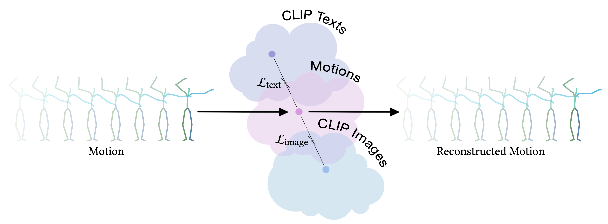

# MotionCLIP

Official Pytorch implementation of the paper [**"MotionCLIP: Exposing Human Motion Generation to CLIP Space"**](http://arxiv.org/abs/2203.08063).

Please visit our [**webpage**](https://guytevet.github.io/motionclip-page/) for more details.



#### Bibtex
If you find this code useful in your research, please cite:

```
@article{tevet2022motionclip,
title={MotionCLIP: Exposing Human Motion Generation to CLIP Space},
author={Tevet, Guy and Gordon, Brian and Hertz, Amir and Bermano, Amit H and Cohen-Or, Daniel},
journal={arXiv preprint arXiv:2203.08063},
year={2022}
}
```

## Getting started
### 1. Create conda environment

```
conda env create -f environment.yml
conda activate motionclip
```

The code was tested on Python 3.8 and PyTorch 1.8.1.

### 2. Download data

Download and unzip the above datasets and place them correspondingly:
* [AMASS](https://amass.is.tue.mpg.de/) -> `./data/amass` (Download the SMPL+H version for each dataset separately, please note to download ALL the dataset in AMASS website)
* [BABEL](https://babel.is.tue.mpg.de/) -> `./data/babel_v1.0_release`
* [Rendered AMASS images](https://drive.google.com/file/d/1F8VLY4AC2XPaV3DqKZefQJNWn4KY2z_c/view?usp=sharing) -> `./data/render`

### 3. Download the SMPL body model

```bash
bash prepare/download_smpl_files.sh
```
This will download the SMPL neutral model from this [**github repo**](https://github.com/classner/up/blob/master/models/3D/basicModel_neutral_lbs_10_207_0_v1.0.0.pkl) and additionnal files.

In addition, download the **Extended SMPL+H model** (used in AMASS project) from [MANO](https://mano.is.tue.mpg.de/), and place it in `./models/smplh`.

### 4. Parse data
Process the three datasets into a unified dataset with `(text, image, motion)` triplets.

To parse acording to the AMASS split (for all applications except action recognition), run:
```bash
python -m src.datasets.amass_parser --dataset_name amass
```

**Only if** you intend to use **Action Recognition**, run also:
```bash
python -m src.datasets.amass_parser --dataset_name babel
```

## Using the pretrained model

First, [download the model](https://drive.google.com/file/d/1VTIN0kJd2-0NW1sKckKgXddwl4tFZVDp/view?usp=sharing) and place it at `./exps/paper-model`

### 1. Text-to-Motion

To reproduce paper results, run:
```bash
 python -m src.visualize.text2motion ./exps/paper-model/checkpoint_0100.pth.tar --input_file assets/paper_texts.txt
```

To run MotionCLIP with your own texts, create a text file, with each line depicts a different text input (see `paper_texts.txt` as a reference) and point to it with `--input_file` instead.


### 2. Vector Editing

To reproduce paper results, run:
```bash
 python -m src.visualize.motion_editing ./exps/paper-model/checkpoint_0100.pth.tar --input_file assets/paper_edits.csv
```

To gain the input motions, we support two modes:
* `data` - Retrieve motions from train/validation sets, according to their textual label. On it first run, `src.visualize.motion_editing` generates a file containing a list of all textual labels. You can look it up and choose motions for your own editing.
* `text` - The inputs are free texts, instead of motions. We use CLIP text encoder to get CLIP representations, perform vector editing, then use MotionCLIP decoder to output the edited motion.

To run MotionCLIP on your own editing, create a csv file, with each line depicts a different edit (see `paper_edits.csv` as a reference) and point to it with `--input_file` instead.

### 3. Interpolation

To reproduce paper results, run:
```bash
 python -m src.visualize.motion_interpolation ./exps/paper-model/checkpoint_0100.pth.tar --input_file assets/paper_interps.csv
```

To gain the input motions, we use the `data` mode described earlier.

To run MotionCLIP on your own interpolations, create a csv file, with each line depicts a different interpolation (see `paper_interps.csv` as a reference) and point to it with `--input_file` instead.


### 4. Action Recognition

For action recognition, we use a model trained on text class names. [Download](https://drive.google.com/file/d/1koQMhpqmoffIB0C0P99a8l23YLGfthJ4/view?usp=sharing) and place it at `./exps/classes-model`.
 
```bash
python -m src.utils.action_classifier ./exps/classes-model/checkpoint_0200.pth.tar
```


## Train your own

**NOTE (11/MAY/22):** 
The paper model is not perfectly reproduced using this code. We are working to resolve this issue. 
The trained model [checkpoint](https://drive.google.com/file/d/1VTIN0kJd2-0NW1sKckKgXddwl4tFZVDp/view?usp=sharing) we provide does reproduce results.

To reproduce `paper-model` run:
```bash
python -m src.train.train --clip_text_losses cosine --clip_image_losses cosine --pose_rep rot6d \
--lambda_vel 100 --lambda_rc 100 --lambda_rcxyz 100 \
--jointstype vertices --batch_size 20 --num_frames 60 --num_layers 8 \
--lr 0.0001 --glob --translation --no-vertstrans --latent_dim 512 --num_epochs 100 --snapshot 10 \
--device <GPU DEVICE ID> \
--datapath ./data/amass_db/amass_30fps_db.pt \
--folder ./exps/my-paper-model
```

To reproduce `classes-model` run:
```bash
python -m src.train.train --clip_text_losses cosine --clip_image_losses cosine --pose_rep rot6d \
--lambda_vel 95 --lambda_rc 95 --lambda_rcxyz 95 \
--jointstype vertices --batch_size 20 --num_frames 60 --num_layers 8 \
--lr 0.0001 --glob --translation --no-vertstrans --latent_dim 512 --num_epochs 200 --snapshot 10 \
--device <GPU DEVICE ID> \
--datapath ./data/amass_db/babel_30fps_db.pt \
--folder ./exps/my-classes-model
```

## Acknowledgment

The code of the transformer model and the dataloader are based on [ACTOR](https://github.com/Mathux/ACTOR) repository. 

## License
This code is distributed under an [MIT LICENSE](LICENSE).

Note that our code depends on other libraries, including CLIP, SMPL, SMPL-X, PyTorch3D, and uses datasets which each have their own respective licenses that must also be followed.
